# Smart Test Generator


**An intelligent, AI-powered test generation tool that analyzes existing coverage, code quality, and test patterns to generate comprehensive unit tests for Python codebases.**

## 🚀 Overview

Smart Test Generator revolutionizes Python testing by combining **static analysis**, **coverage metrics**, **quality assessment**, and **AI-powered generation** to create missing tests intelligently. Unlike traditional test generators, it focuses on incremental improvement and quality-driven development.

### ✨ Key Features

- 🧠 **AI-Powered Generation**: Leverages Claude 4 Sonnet, Claude 3.x models, and Azure OpenAI for intelligent test creation
- 🔍 **Coverage-Driven Analysis**: Only generates tests for uncovered code, avoiding redundancy
- 📊 **Quality Assessment**: Multi-dimensional test quality scoring with mutation testing
- 🧩 **Incremental Generation**: Generates only missing tests, preserving existing work
- 🏗️ **AST-Based Analysis**: Advanced Python AST parsing for accurate code understanding
- 📈 **Progress Tracking**: Comprehensive history and improvement metrics
- 🎨 **Professional CLI**: Beautiful command-line interface with Rich library
- 💰 **Cost Management**: Built-in token usage tracking and cost optimization

## 📋 Table of Contents

- [🚀 Overview](#-overview)
- [📦 Installation](#-installation)
- [🚀 Quick Start](#-quick-start)
- [🔄 Usage Instructions](#-using-in-different-projects)
- [🛠️ Configuration](#️-configuration)
- [📊 CLI Commands](#-cli-commands)
- [🔧 Advanced Usage](#-advanced-usage)
- [🔧 Troubleshooting](#-troubleshooting)
- [📚 Examples & Output](#-examples--output)
- [🛠️ Development Guide](#️-development-guide)
- [🧪 Testing & Development](#-testing--development)
- [📈 Performance & Optimization](#-performance--optimization)
- [🚨 Security](#-security)
- [🤝 Contributing](#-contributing)
- [❓ Frequently Asked Questions](#-frequently-asked-questions)
- [📝 License](#-license)

## 🏗️ Architecture

### System Architecture


### Component Responsibilities

```mermaid
graph LR
    subgraph "🧠 Analysis Components"
        CA[CodeAnalyzer<br/>• AST parsing<br/>• Element extraction<br/>• Complexity analysis]
        CVA[CoverageAnalyzer<br/>• pytest integration<br/>• AST fallback<br/>• Gap identification]
        TM[TestMapper<br/>• Test discovery<br/>• Import analysis<br/>• Completeness check]
    end
    
    subgraph "📊 Quality Components"
        QA[QualityAnalyzer<br/>• Multi-dimension scoring<br/>• Edge case detection<br/>• Maintainability check]
        ME[MutationEngine<br/>• Mutation generation<br/>• Test effectiveness<br/>• Weak spot detection]
    end
    
    subgraph "🤖 Generation Components"
        LLM[LLM Clients<br/>• Claude API<br/>• Azure OpenAI<br/>• Content validation]
        IG[IncrementalGenerator<br/>• Context-aware<br/>• Test merging<br/>• Quality-driven]
    end
    
    subgraph "🎯 Services"
        AS[AnalysisService<br/>• Orchestrates analysis<br/>• File discovery<br/>• Plan creation]
        TGS[TestGenerationService<br/>• Batch processing<br/>• Progress tracking<br/>• Result management]
    end
    
    style CA fill:#e3f2fd
    style CVA fill:#e3f2fd
    style TM fill:#e3f2fd
    style QA fill:#f1f8e9
    style ME fill:#f1f8e9
    style LLM fill:#fce4ec
    style IG fill:#fce4ec
    style AS fill:#fff3e0
    style TGS fill:#fff3e0
```



## 🔄 Workflow & Sequence Diagrams

### Test Generation Workflow


### Coverage Analysis Flow


### Quality Analysis Sequence


## 📦 Installation

### Prerequisites

- Python 3.8+
- pip or uv package manager

### Quick Install

```bash
# Using uv (recommended)
uv pip install -e .

# Using pip
pip install -e .
```

### Development Install

```bash
# Clone the repository
git clone https://github.com/yourusername/smart-test-generator.git
cd smart-test-generator

# Install with development dependencies
uv pip install -e ".[dev]"

# Verify installation
smart-test-gen --help
```

## 🚀 Quick Start

### 1. Configure API Credentials

```bash
# Claude API (recommended)
export CLAUDE_API_KEY="your-claude-api-key"

# Or Azure OpenAI
export AZURE_OPENAI_ENDPOINT="your-endpoint"
export AZURE_OPENAI_API_KEY="your-api-key"
export AZURE_OPENAI_DEPLOYMENT="your-deployment"
```

### 2. Initialize Configuration

```bash
smart-test-gen init-config
```

This creates a `.testgen.yml` file with intelligent defaults:

```yaml
test_generation:
  test_patterns:
    - "test_*.py"
    - "*_test.py"
  exclude_dirs:
    - "venv"
    - "__pycache__"
  coverage:
    minimum_line_coverage: 80
    minimum_branch_coverage: 70
  generation:
    include_docstrings: true
    generate_fixtures: true
quality:
  enable_mutation_testing: true
  minimum_quality_score: 75.0
  minimum_mutation_score: 80.0

# Prompt Engineering Settings (Based on Anthropic 2025 Guidelines)
prompt_engineering:
  use_2025_guidelines: true          # Use improved prompts following Anthropic's latest best practices
  encourage_step_by_step: true       # Include step-by-step reasoning prompts
  use_positive_negative_examples: true  # Include ✓/✗ examples in prompts
  minimize_xml_structure: true       # Reduce excessive XML tags in prompts  
  decisive_recommendations: true     # Encourage single, strong recommendations
  preserve_uncertainty: false       # Whether to include hedging language (usually False for technical tasks)
```

### 3. Analyze Your Codebase

```bash
# Get comprehensive analysis
smart-test-gen analyze --directory ./src

# Check current coverage
smart-test-gen coverage --directory ./src

# View generation history
smart-test-gen status
```

### 4. Generate Missing Tests

```bash
# Generate tests with default settings
smart-test-gen generate --directory ./src

# Generate with specific model
smart-test-gen generate --claude-model claude-sonnet-4-20250514

# Dry run to see what would be generated
smart-test-gen generate --dry-run

# Force regeneration of all tests
smart-test-gen generate --force
```

## 🔄 Using in Different Projects

### Installation Options

#### Option 1: Install as a Package (Recommended)

**From the smart-test-generator directory:**
```bash
# Navigate to the smart-test-generator project directory
cd /path/to/smart-test-generator

# Install the package
pip install -e .
# or using uv (faster)
uv pip install -e .
```

**From your target project:**
```bash
# Navigate to your project directory
cd /path/to/your/project

# Install directly from the smart-test-generator directory
pip install -e /path/to/smart-test-generator
```

#### Option 2: Copy and Customize

Copy the entire `smart-test-generator` project to your target project as a submodule or subdirectory, then install it locally.

### Setup in Your Project

#### 1. Configure API Credentials

Set up your AI provider credentials:

```bash
# For Claude API (recommended for test generation)
export CLAUDE_API_KEY="your-claude-api-key-here"

# OR for Azure OpenAI
export AZURE_OPENAI_ENDPOINT="your-endpoint-url"
export AZURE_OPENAI_API_KEY="your-api-key"
export AZURE_OPENAI_DEPLOYMENT="your-deployment-name"
```

#### 2. Initialize Configuration

In your target project directory:

```bash
# Create configuration file
smart-test-gen init-config

# This creates a .testgen.yml file with default settings
```

#### 3. Customize Configuration

Edit the generated `.testgen.yml` file for your project needs:

```yaml
test_generation:
  test_patterns:
    - "test_*.py"         # Your test file patterns
    - "*_test.py"
  exclude_dirs:
    - "venv"              # Add your specific directories to exclude
    - "node_modules"      # If you have mixed projects
    - "build"
  coverage:
    minimum_line_coverage: 80
    minimum_branch_coverage: 70

# Model preferences (Claude Sonnet 4 recommended for quality)
llm:
  preferred_model: "claude-sonnet-4-20250514"
  max_tokens: 4000
  temperature: 0.1

# Security settings
security:
  block_dangerous_patterns: true
  max_generated_file_size: 50000
```

### Basic Usage Commands

```bash
# Navigate to your project
cd /path/to/your/project

# Analyze your codebase
smart-test-gen analyze --directory ./src

# Check current test coverage
smart-test-gen coverage --directory ./src

# Generate missing tests
smart-test-gen generate --directory ./src

# View generation status and history
smart-test-gen status
```

### Advanced Usage Examples

```bash
# Generate tests with specific model
smart-test-gen generate --claude-model claude-sonnet-4-20250514

# Dry run to preview what would be generated
smart-test-gen generate --dry-run --directory ./src

# Force regeneration of all tests
smart-test-gen generate --force

# Cost-optimized generation
smart-test-gen generate --cost-optimize --max-cost 5.00

# Batch processing for large codebases
smart-test-gen generate --batch-size 5
```

### Project Structure Integration

The tool works with any Python project structure and automatically:

- **Finds Python files** in your source directories
- **Discovers existing tests** using common patterns
- **Analyzes test coverage** using pytest or AST fallback
- **Generates missing tests** only for uncovered code
- **Preserves existing tests** and builds incrementally

#### Example Integration

For a typical Python project:
```
your-project/
├── src/
│   └── your_package/
│       ├── __init__.py
│       ├── module1.py
│       └── module2.py
├── tests/
│   ├── test_module1.py    # Existing tests
│   └── test_module2.py    # Will be generated if missing
├── .testgen.yml           # Configuration file
└── requirements.txt
```

### Workflow Integration

#### CI/CD Integration

Add to your CI pipeline:

```yaml
# .github/workflows/test-generation.yml
name: Generate Missing Tests

on: [push, pull_request]

jobs:
  generate-tests:
    runs-on: ubuntu-latest
    steps:
      - uses: actions/checkout@v4
      - name: Set up Python
        uses: actions/setup-python@v4
        with:
          python-version: '3.9'
      
      - name: Install smart-test-generator
        run: pip install -e /path/to/smart-test-generator
      
      - name: Analyze coverage
        run: smart-test-gen coverage --directory ./src
        env:
          CLAUDE_API_KEY: ${{ secrets.CLAUDE_API_KEY }}
      
      - name: Generate missing tests
        run: smart-test-gen generate --directory ./src --dry-run
        env:
          CLAUDE_API_KEY: ${{ secrets.CLAUDE_API_KEY }}
```

#### Pre-commit Hook

```bash
# Add to .pre-commit-config.yaml
repos:
  - repo: local
    hooks:
      - id: test-generation-check
        name: Check test coverage
        entry: smart-test-gen coverage --directory ./src
        language: system
        pass_filenames: false
```

### Customization for Different Project Types

#### Django Projects

```yaml
test_generation:
  test_patterns:
    - "tests/test_*.py"
    - "*/tests.py"
  exclude_dirs:
    - "migrations"
    - "staticfiles"
    - "media"
  style:
    framework: pytest
    assertion_style: assert
```

#### Flask/FastAPI Projects

```yaml
test_generation:
  test_patterns:
    - "tests/test_*.py"
    - "test_*.py"
  exclude_dirs:
    - "instance"
    - "static"
  generation:
    generate_fixtures: true    # Useful for API testing
```

#### Data Science Projects

```yaml
test_generation:
  test_patterns:
    - "tests/test_*.py"
  exclude_dirs:
    - "data"
    - "notebooks"
    - "models"
  generation:
    include_docstrings: true   # Important for data science functions
```

### Best Practices for Different Projects

1. **Start Small**: Begin with a single module or package
2. **Review Generated Tests**: Always review AI-generated tests before committing
3. **Iterative Improvement**: Use the tool repeatedly as your code evolves
4. **Cost Management**: Set cost limits and use batch processing for large codebases
5. **Quality Focus**: Use the quality analysis features to improve test effectiveness
6. **Custom Patterns**: Adapt test patterns to match your project's conventions
7. **Security First**: Enable security features for production projects

## 🛠️ Configuration

### Configuration File Structure

```yaml
test_generation:
  test_patterns:           # Test file naming patterns
  exclude_dirs:           # Directories to skip
  coverage:
    minimum_line_coverage: 80
    minimum_branch_coverage: 70
  generation:
    include_docstrings: true
    generate_fixtures: true
    max_elements_per_file: 20

quality:
  enable_mutation_testing: true
  minimum_quality_score: 75.0
  minimum_mutation_score: 80.0
  max_mutants_per_file: 50
  mutation_timeout: 30

llm:
  preferred_model: "claude-sonnet-4-20250514"
  max_tokens: 4000
  temperature: 0.1
  cost_optimization: true

security:
  block_dangerous_patterns: true
  max_generated_file_size: 50000
```

### Automatic Exclusions

The system automatically excludes common directories:

- **Virtual Environments**: `venv`, `env`, `.venv`, virtualenv patterns
- **Build Directories**: `build`, `dist`, `*.egg-info`, `__pycache__`
- **Cache Directories**: `.pytest_cache`, `.mypy_cache`, `.ruff_cache`
- **IDE Directories**: `.vscode`, `.idea`, `.vs`
- **Version Control**: `.git`, `.hg`, `.svn`

## 💡 Key Innovations

### AST-Based Analysis

Unlike regex-based tools, Smart Test Generator uses Python's Abstract Syntax Tree for:

- **Accurate Import Detection**: Understands all Python import patterns
- **Test Completeness Analysis**: Detects what's actually being tested
- **Element Extraction**: Properly identifies functions, methods, and classes
- **Context Understanding**: Handles complex code structures and patterns

### Quality-Driven Generation

Our multi-dimensional quality assessment includes:

- **Edge Case Coverage**: Identifies missing boundary conditions
- **Assertion Strength**: Evaluates test robustness
- **Maintainability**: Assesses code structure and clarity
- **Bug Detection Potential**: Uses mutation testing for effectiveness

### Incremental Intelligence

- **Smart Planning**: Only generates tests for uncovered elements
- **Context Awareness**: Considers existing test patterns and styles
- **Progressive Enhancement**: Builds upon existing test suites
- **Quality Targeting**: Adapts generation based on current quality metrics

## 📊 CLI Commands

### Analysis Commands

```bash
# Comprehensive analysis
smart-test-gen analyze [OPTIONS]
  --directory PATH     Target directory (default: current)
  --force             Force re-analysis
  --verbose           Detailed output

# Coverage analysis
smart-test-gen coverage [OPTIONS]
  --directory PATH     Target directory
  --verbose           Show detailed coverage metrics

# Generation status
smart-test-gen status [OPTIONS]
  --directory PATH     Target directory
```

### Generation Commands

```bash
# Test generation
smart-test-gen generate [OPTIONS]
  --directory PATH            Target directory
  --claude-api-key KEY       Claude API key
  --claude-model MODEL       Claude model selection
  --azure-endpoint URL       Azure OpenAI endpoint
  --azure-api-key KEY        Azure API key
  --azure-deployment NAME    Azure deployment name
  --batch-size N             Files per batch (default: 10)
  --force                    Regenerate all tests
  --dry-run                  Preview without changes
  --cost-optimize            Enable cost optimization
  --max-cost AMOUNT          Maximum cost limit

# Cost tracking
smart-test-gen cost [OPTIONS]
  --usage-days N             Days to analyze (default: 30)
```

### Configuration Commands

```bash
# Initialize configuration
smart-test-gen init-config [OPTIONS]
  --config PATH              Config file path (default: .testgen.yml)
  --template TYPE            Template type (basic|advanced)
```

## 🔧 Advanced Usage

### Supported Models

#### Claude API Models
- **claude-opus-4-20250514** - Most capable, highest cost
- **claude-sonnet-4-20250514** - Balanced performance and cost (default)
- **claude-3-7-sonnet-20250219** - High performance  
- **claude-3-5-sonnet-20241022** - Good balance
- **claude-3-5-haiku-20241022** - Fast and cost-effective
- **claude-3-haiku-20240307** - Fastest, lowest cost

#### Azure OpenAI Models
- Supports any deployed model via custom endpoint and deployment configuration
- Typically GPT-4 and GPT-3.5 family models

### Custom Quality Analyzers

```python
from smart_test_generator.analysis.quality_analyzer import QualityAnalyzer
from smart_test_generator.models.data_models import QualityDimension, QualityScore

class CustomQualityAnalyzer(QualityAnalyzer):
    def get_dimension(self) -> QualityDimension:
        return QualityDimension.CUSTOM_METRIC
    
    def analyze(self, test_code: str, source_code: str = "") -> QualityScore:
        # Your custom analysis logic
        return QualityScore(
            dimension=self.get_dimension(),
            score=calculated_score,
            suggestions=improvement_suggestions
        )
```

### Custom Mutation Operators

```python
from smart_test_generator.analysis.mutation_engine import MutationOperator
from smart_test_generator.models.data_models import MutationType, Mutant

class CustomMutationOperator(MutationOperator):
    def get_mutation_type(self) -> MutationType:
        return MutationType.CUSTOM_MUTATION
    
    def generate_mutants(self, source_code: str, filepath: str) -> List[Mutant]:
        # Your custom mutation logic
        return mutants
```

### Batch Processing

```python
from smart_test_generator.core import SmartTestGeneratorApp

app = SmartTestGeneratorApp(target_dir, project_root, config)

# Process multiple directories
for directory in directories:
    app.target_dir = directory
    results = app.run_generate_mode(llm_credentials, batch_size=5)
```

## 🧪 Testing & Development

### Running Tests

```bash
# Run all tests
pytest

# Run with coverage
pytest --cov=src/smart_test_generator --cov-report=html

# Run specific test categories
pytest tests/analysis/
pytest tests/generation/
pytest tests/services/
```

### Code Quality

```bash
# Format code
black src/ tests/

# Lint code
ruff check src/ tests/

# Type checking
mypy src/
```

### Contributing

1. Fork the repository
2. Create a feature branch: `git checkout -b feature-name`
3. Make your changes
4. Add tests for new functionality
5. Run the test suite: `pytest`
6. Submit a pull request

## 📈 Performance & Optimization

### Cost Optimization

- **Batch Processing**: Groups similar files for efficient LLM usage
- **Smart Caching**: Reuses analysis results across sessions
- **Model Selection**: Automatic model selection based on complexity
- **Token Management**: Optimizes prompt size and context

### Performance Tips

```bash
# Use smaller batch sizes for large files
smart-test-gen generate --batch-size 5

# Enable cost optimization
smart-test-gen generate --cost-optimize

# Set cost limits
smart-test-gen generate --max-cost 10.00

# Use faster/cheaper models for simple files
smart-test-gen generate --claude-model claude-3-5-haiku-20241022
```

## 🚨 Security

### Built-in Security Features

- **Pattern Blocking**: Prevents generation of dangerous code patterns
- **Content Validation**: AST-based validation of generated tests
- **Size Limits**: Configurable limits on generated file sizes

### Security Configuration

```yaml
security:
  block_dangerous_patterns: true      # Block eval, exec, etc.
  max_generated_file_size: 50000     # Max file size in bytes
  allowed_imports:                    # Whitelist allowed imports
    - "pytest"
    - "unittest"
    - "mock"
  blocked_imports:                    # Blacklist dangerous imports
    - "subprocess"
    - "os.system"
```

## 🔧 Troubleshooting

### Common Issues

#### Installation Problems

**Issue**: `smart-test-gen: command not found`
```bash
# Solution: Ensure the package is installed and in PATH
pip install -e .
# or
uv pip install -e .

# Verify installation
python -m smart_test_generator --help
```

**Issue**: Python version compatibility
```bash
# Check Python version
python --version

# Install compatible Python version if needed
# Use pyenv, conda, or system package manager
```

#### API Key Issues

**Issue**: Authentication errors
```bash
# Verify API key is set
echo $CLAUDE_API_KEY
echo $AZURE_OPENAI_API_KEY

# Test API connection
smart-test-gen generate --dry-run --directory ./src
```

**Issue**: Where to get API keys
- **Claude API**: Sign up at [console.anthropic.com](https://console.anthropic.com)
- **Azure OpenAI**: Set up through Azure Portal under AI + Machine Learning

#### Generation Issues

**Issue**: No tests generated
```bash
# Check if files are found
smart-test-gen analyze --directory ./src --verbose

# Verify test patterns in config
cat .testgen.yml
```

**Issue**: Tests not covering expected code
```bash
# Run coverage analysis first
smart-test-gen coverage --directory ./src --verbose

# Check exclusion patterns
smart-test-gen analyze --directory ./src
```

#### Performance Issues

**Issue**: Slow generation
```bash
# Use smaller batch sizes
smart-test-gen generate --batch-size 3

# Use faster model
smart-test-gen generate --claude-model claude-3-5-haiku-20241022
```

### Debug Mode

Enable verbose logging for troubleshooting:

```bash
# Enable debug logging
export SMART_TEST_GEN_DEBUG=1
smart-test-gen generate --directory ./src --verbose

# Check log files
ls -la .testgen/logs/
```

### Getting Help

1. **Check Logs**: Review `.testgen/logs/` for detailed error messages
2. **Validate Config**: Use `smart-test-gen init-config` to regenerate config
3. **Test Isolation**: Try with a single file first
4. **Community**: Open an issue on GitHub with:
   - Python version
   - OS information
   - Complete error message
   - Configuration file content

## 📚 Examples & Output

### Example Generated Test

**Source Code** (`src/calculator.py`):
```python
def add(a, b):
    """Add two numbers."""
    return a + b

def divide(a, b):
    """Divide two numbers."""
    if b == 0:
        raise ValueError("Cannot divide by zero")
    return a / b
```

**Generated Test** (`tests/test_calculator.py`):
```python
import pytest
from src.calculator import add, divide

class TestAdd:
    def test_add_positive_numbers(self):
        """Test adding positive numbers."""
        result = add(2, 3)
        assert result == 5
    
    def test_add_negative_numbers(self):
        """Test adding negative numbers."""
        result = add(-2, -3)
        assert result == -5
    
    def test_add_mixed_numbers(self):
        """Test adding positive and negative numbers."""
        result = add(5, -3)
        assert result == 2

class TestDivide:
    def test_divide_positive_numbers(self):
        """Test dividing positive numbers."""
        result = divide(6, 2)
        assert result == 3.0
    
    def test_divide_by_zero_raises_error(self):
        """Test that dividing by zero raises ValueError."""
        with pytest.raises(ValueError, match="Cannot divide by zero"):
            divide(5, 0)
    
    def test_divide_negative_numbers(self):
        """Test dividing negative numbers."""
        result = divide(-6, -2)
        assert result == 3.0
```

### Sample Coverage Report

```
Coverage Analysis Results
=======================
File: src/calculator.py
- Lines covered: 4/6 (66.7%)
- Branches covered: 1/2 (50.0%)
- Missing coverage: lines 7-8 (error handling)

Recommended Tests:
✓ Basic functionality tests
✗ Edge case: division by zero
✗ Type validation tests
```

## 🛠️ Development Guide

### Prerequisites for Development

- Python 3.8+
- Git
- Virtual environment tool (venv, conda, or virtualenv)

### Development Environment Setup

```bash
# Clone the repository
git clone https://github.com/yourusername/smart-test-generator.git
cd smart-test-generator

# Create virtual environment
python -m venv venv
source venv/bin/activate  # On Windows: venv\Scripts\activate

# Install development dependencies
uv pip install -e ".[dev]"
# or
pip install -e ".[dev]"

# Install pre-commit hooks
pre-commit install

# Verify setup
smart-test-gen --help
pytest --version
```

### Project Structure for Developers

```
smart-test-generator/
├── src/smart_test_generator/      # Main package
│   ├── cli.py                     # Command-line interface
│   ├── config.py                  # Configuration management
│   ├── core/                      # Core application logic
│   ├── analysis/                  # Code analysis components
│   ├── generation/                # Test generation components
│   ├── services/                  # Service layer
│   └── utils/                     # Utility functions
├── tests/                         # Test suite
├── pyproject.toml                 # Package configuration
└── README.md                      # This file
```

### Development Workflow

#### 1. Making Changes

```bash
# Create feature branch
git checkout -b feature/your-feature-name

# Make changes
# Edit code...

# Run tests
pytest

# Check code quality
black src/ tests/
ruff check src/ tests/
mypy src/
```

#### 2. Testing Your Changes

```bash
# Run all tests
pytest

# Run specific test categories
pytest tests/analysis/          # Analysis tests
pytest tests/generation/        # Generation tests
pytest tests/services/          # Service tests

# Run with coverage
pytest --cov=src/smart_test_generator --cov-report=html

# Test the CLI manually
smart-test-gen generate --dry-run --directory ./tests/fixtures/
```

#### 3. Debugging

```bash
# Enable debug mode
export SMART_TEST_GEN_DEBUG=1

# Run with verbose output
smart-test-gen generate --directory ./src --verbose

# Use Python debugger
python -m pdb -m smart_test_generator.cli generate --directory ./src

# Check logs
tail -f .testgen/logs/smart_test_generator.log
```

### Adding New Features

#### 1. New Analysis Components

```python
# src/smart_test_generator/analysis/my_analyzer.py
from smart_test_generator.analysis.base_analyzer import BaseAnalyzer

class MyAnalyzer(BaseAnalyzer):
    def analyze(self, source_code: str, file_path: str) -> AnalysisResult:
        # Your analysis logic
        return AnalysisResult(...)
```

#### 2. New LLM Providers

```python
# src/smart_test_generator/generation/my_llm_client.py
from smart_test_generator.generation.base_llm_client import BaseLLMClient

class MyLLMClient(BaseLLMClient):
    def generate_tests(self, prompt: str) -> str:
        # Your LLM integration
        return generated_test_code
```

#### 3. New CLI Commands

```python
# Add to src/smart_test_generator/cli.py
def add_my_command_parser(subparsers):
    parser = subparsers.add_parser('my-command', help='My new command')
    parser.add_argument('--option', help='Command option')
    parser.set_defaults(func=handle_my_command)

def handle_my_command(args):
    # Command implementation
    pass
```

### Testing Guidelines

#### Writing Tests

1. **Unit Tests**: Test individual components in isolation
2. **Integration Tests**: Test component interactions
3. **End-to-End Tests**: Test complete workflows
4. **Mock External Dependencies**: Use mocks for LLM APIs

```python
# Example test structure
def test_my_feature():
    # Arrange
    input_data = create_test_data()
    
    # Act
    result = my_feature(input_data)
    
    # Assert
    assert result.is_valid()
    assert result.output == expected_output
```

#### Test Fixtures

```python
# tests/conftest.py
import pytest

@pytest.fixture
def sample_python_file():
    return """
def add(a, b):
    return a + b
"""

@pytest.fixture
def mock_llm_client():
    # Return mocked LLM client
    pass
```

### Code Quality Standards

- **Code Formatting**: Use `black` with 100-character line length
- **Linting**: Use `ruff` for fast Python linting
- **Type Checking**: Use `mypy` for static type analysis
- **Documentation**: Use clear docstrings and type hints
- **Test Coverage**: Maintain >85% test coverage

### Release Process

1. **Update Version**: Modify version in `pyproject.toml`
2. **Update Changelog**: Document changes
3. **Run Full Test Suite**: `pytest`
4. **Build Package**: `python -m build`
5. **Create Release**: Tag and push to GitHub
6. **Publish**: Upload to PyPI (if applicable)

## 📝 License

This project is licensed under the MIT License - see the [LICENSE](LICENSE) file for details.

## 🤝 Contributing

We welcome contributions! Here's how to get involved:

### Quick Contribution Guide

1. **Fork** the repository on GitHub
2. **Clone** your fork locally
3. **Create** a feature branch: `git checkout -b feature/your-feature-name`
4. **Make** your changes following our code standards
5. **Test** your changes thoroughly
6. **Commit** with clear, descriptive messages
7. **Push** to your fork and **submit** a pull request

### Types of Contributions

- 🐛 **Bug Reports**: Found an issue? Open a GitHub issue with details
- 💡 **Feature Requests**: Have an idea? Describe it in a GitHub issue
- 🔧 **Code Contributions**: Fix bugs or implement new features
- 📖 **Documentation**: Improve README, docstrings, or examples
- 🧪 **Testing**: Add test cases or improve test coverage
- 🎨 **UI/UX**: Improve CLI interface or user experience

### Development Setup

See the **🛠️ Development Guide** section above for complete setup instructions.

### Coding Standards

- Follow **PEP 8** Python style guidelines
- Use **type hints** for all function parameters and return values
- Write **comprehensive docstrings** for all public methods
- Maintain **>85% test coverage** for new code
- Use **clear, descriptive variable names**

### Pull Request Guidelines

#### Before Submitting

```bash
# Ensure all tests pass
pytest

# Check code formatting
black src/ tests/
ruff check src/ tests/

# Verify type checking
mypy src/

# Test your changes manually
smart-test-gen generate --dry-run --directory ./tests/fixtures/
```

#### PR Description Template

```markdown
## Description
Brief description of changes made.

## Type of Change
- [ ] Bug fix (non-breaking change that fixes an issue)
- [ ] New feature (non-breaking change that adds functionality)
- [ ] Breaking change (fix or feature that would cause existing functionality to not work as expected)
- [ ] Documentation update

## Testing
- [ ] I have added tests that prove my fix is effective or that my feature works
- [ ] New and existing unit tests pass locally with my changes
- [ ] I have tested the CLI commands manually

## Checklist
- [ ] My code follows the style guidelines of this project
- [ ] I have performed a self-review of my own code
- [ ] I have commented my code, particularly in hard-to-understand areas
- [ ] I have made corresponding changes to the documentation
- [ ] My changes generate no new warnings
```

### Issue Reporting

When reporting bugs, please include:

- **Python version** and OS
- **Complete error message** and stack trace
- **Steps to reproduce** the issue
- **Configuration file** content (remove sensitive data)
- **Sample code** that triggers the bug

### Community Guidelines

- **Be respectful** and constructive in all interactions
- **Search existing issues** before creating new ones
- **Provide clear, detailed descriptions** in issues and PRs
- **Follow up** on your contributions and respond to feedback
- **Help others** by reviewing PRs and answering questions

For more details, see our [Contributing Guidelines](CONTRIBUTING.md) and [Code of Conduct](CODE_OF_CONDUCT.md).

## ❓ Frequently Asked Questions

### General Usage

**Q: How does Smart Test Generator differ from other test generation tools?**
A: Smart Test Generator focuses on incremental improvement by analyzing existing coverage and only generating tests for uncovered code. It uses advanced AST analysis and AI-powered generation with quality assessment, unlike simple template-based generators.

**Q: Which AI model should I use?**
A: For best quality, use `claude-sonnet-4-20250514`. For cost optimization, use `claude-3-5-haiku-20241022`. Azure OpenAI models are also supported for enterprise users.

**Q: Can I use this with existing test suites?**
A: Yes! The tool is designed to work with existing tests. It analyzes your current test coverage and only generates tests for uncovered code, preserving your existing work.

**Q: How much does it cost to generate tests?**
A: Costs depend on your codebase size and chosen model. Use `--cost-optimize` and `--max-cost` flags to control spending. Typical costs range from $0.10-$2.00 per file depending on complexity.

### Technical Questions

**Q: What Python versions are supported?**
A: Python 3.8+ is required. The tool uses modern Python features and typing.

**Q: Does it work with different testing frameworks?**
A: Currently supports pytest and unittest. The generated tests can be configured for either framework in the `.testgen.yml` configuration.

**Q: Can I customize the generated test patterns?**
A: Yes! Configure `test_patterns`, `style.framework`, `style.assertion_style`, and other settings in your `.testgen.yml` file.

**Q: How does coverage analysis work without running tests?**
A: The tool uses pytest integration for accurate coverage when possible, but falls back to AST-based analysis to estimate coverage by analyzing imports and test patterns.

**Q: Can I extend the tool with custom analyzers?**
A: Yes! See the **🔧 Advanced Usage** section for examples of creating custom quality analyzers and mutation operators.

### Troubleshooting

**Q: Why aren't any tests being generated?**
A: Check that:
1. Files are found: `smart-test-gen analyze --directory ./src`
2. API keys are set: `echo $CLAUDE_API_KEY`
3. Configuration is correct: `cat .testgen.yml`
4. Files aren't excluded by patterns

**Q: The tool is running slowly. How can I speed it up?**
A: Try:
- Smaller batch sizes: `--batch-size 3`
- Faster model: `--claude-model claude-3-5-haiku-20241022`
- Cost optimization: `--cost-optimize`
- Exclude large directories in configuration

**Q: How do I handle API rate limits?**
A: The tool includes automatic rate limiting and retry logic. Use smaller batch sizes and the `--cost-optimize` flag to reduce API usage.

**Q: Can I run this in CI/CD?**
A: Yes! See the **Workflow Integration** section for GitHub Actions and pre-commit hook examples. Use `--dry-run` for validation without making changes.

### Security & Privacy

**Q: Is my code sent to AI providers?**
A: Yes, code is sent to generate tests. Use the security settings to block sensitive patterns, and review the generated tests before committing. Consider using Azure OpenAI for enhanced privacy controls.

**Q: How can I prevent dangerous code generation?**
A: Enable `block_dangerous_patterns: true` in configuration and review all generated tests. The tool includes AST validation to prevent malicious code.

**Q: Can I use this with proprietary/confidential code?**
A: Consider using Azure OpenAI with private endpoints for enhanced security. Always review your organization's AI usage policies before processing confidential code.

---

Made with ❤️ for the Python testing community
