# SlopTest

AI-assisted pytest generation for Python. It analyzes your code and current coverage, then writes only the missing tests. Supports Claude API, Azure OpenAI, and AWS Bedrock.

Key properties
- Coverage-driven: decides what to generate from real or AST-estimated coverage
- Incremental: generates only untested functions/methods
- Safe writers: append or AST-merge into tests/ with optional Black formatting
- Optional post-run + LLM refinement loop to fix failing tests
- Modern Python mutation testing: type hints, async/await, and dataclass patterns
- Quality analysis with comprehensive test strength evaluation

Install (with uv)
```bash
# create and activate a virtualenv (optional but recommended)
uv venv
source .venv/bin/activate   # Windows: .venv\Scripts\activate

# install
uv pip install -e .

# development extras
uv pip install -e .[dev]
```

Quick start
```bash
# Claude API
export CLAUDE_API_KEY=...
sloptest generate

# Azure OpenAI
sloptest generate \
  --endpoint https://<resource>.openai.azure.com \
  --api-key <key> \
  --deployment <deployment>

# AWS Bedrock (assume-role + inference profile)
sloptest generate \
  --bedrock-role-arn arn:aws:iam::<account>:role/<role> \
  --bedrock-inference-profile <profile> \
  --bedrock-region us-east-1
```

How it works

Overview


Coverage path


Planning and generation (per file)


Refinement loop (sequence)


## Complete Pipeline Architecture

### Core Services Architecture


### Command Flow Pipeline
This diagram shows the complete flow for all commands and their conditional branches:

```mermaid
flowchart TD
    Start(["`🚀 **CLI Entry Point**
    __main__.py → cli.py`"]) --> ArgParse["`⚙️ **Parse Arguments**
    - Mode selection
    - Credentials & config
    - Processing options`"]
    
    ArgParse --> InitFeedback["`💬 **Initialize UserFeedback**
    - Verbose/quiet modes
    - Rich UI setup`"]
    
    InitFeedback --> ConfigLogging["`📝 **Configure Logging**
    - Verbose: DEBUG level
    - Normal: WARNING level  
    - Quiet: ERROR only`"]
    
    ConfigLogging --> WelcomeBanner["`🎨 **Show Welcome Banner**
    (unless quiet mode)`"]
    
    WelcomeBanner --> ModeCheck{"`🎯 **Check Mode**`"}
    
    %% Early exit modes
    ModeCheck -->|init-config| InitConfig["`📄 **Initialize Config**
    - Create .testgen.yml
    - Show features
    - Exit`"]
    
    ModeCheck -->|env| EnvMode["`🌍 **Environment Mode**
    - Show system info
    - Analyze dependencies
    - Display recommendations
    - Exit`"]
    
    %% Main validation pipeline
    ModeCheck -->|Other Modes| SystemValidation["`✅ **System & Project Validation**
    - Python version check
    - CLI dependencies
    - Project structure
    - Environment validation
    - Write permissions`"]
    
    SystemValidation --> LoadConfig["`⚙️ **Load & Validate Config**
    - Parse .testgen.yml
    - Apply CLI overrides
    - Show config summary`"]
    
    LoadConfig --> ValidateArgs["`🔍 **Validate Arguments**
    - Batch size validation
    - Other parameter checks`"]
    
    ValidateArgs --> InitApp["`🏗️ **Initialize SmartTestGeneratorApp**
    - Create services
    - Set up trackers
    - Initialize parsers`"]
    
    InitApp --> ShowEnvInfo{"`🔍 **Verbose Mode?**`"}
    ShowEnvInfo -->|Yes| DisplayEnv["`📊 **Display Environment Info**
    - Environment manager
    - Python version
    - Virtual environment
    - Dependencies status`"]
    ShowEnvInfo -->|No| ExecuteMode
    DisplayEnv --> ExecuteMode
    
    ExecuteMode{"`🎯 **Execute Mode**`"} 
    
    %% Status Mode
    ExecuteMode -->|status| StatusMode["`📊 **Status Mode**
    - Sync state with existing tests
    - Get generation history
    - Show last 10 entries`"]
    
    %% Analyze Mode  
    ExecuteMode -->|analyze| AnalyzeMode["`🔍 **Analyze Mode**`"]
    AnalyzeMode --> SyncState1["`🔄 **Sync State**
    (ensure consistency)`"]
    SyncState1 --> FindFiles1["`📂 **Find Python Files**
    PythonCodebaseParser`"]
    FindFiles1 --> AnalyzeForGen["`🎯 **Analyze Files for Generation**
    - Check coverage thresholds
    - Check state tracker
    - Apply force logic`"]
    AnalyzeForGen --> CreatePlans1["`📋 **Create Test Plans**
    - Parse untested elements
    - Enhance with quality insights`"]
    CreatePlans1 --> AnalyzeQuality1["`⭐ **Analyze Test Quality**
    - Quality scoring
    - Mutation testing
    - Generate reports`"]
    AnalyzeQuality1 --> ShowAnalysis["`📊 **Display Analysis Results**
    - Test plans table
    - Quality analysis
    - Coverage gaps`"]
    
    %% Coverage Mode
    ExecuteMode -->|coverage| CoverageMode["`📈 **Coverage Mode**`"]
    CoverageMode --> SyncState2["`🔄 **Sync State**`"]
    SyncState2 --> FindFiles2["`📂 **Find Python Files**`"]
    FindFiles2 --> RunCoverage["`🧪 **Run Coverage Analysis**
    - Execute pytest with coverage
    - Parse coverage data
    - Update state tracker`"]
    RunCoverage --> GenCoverageReport["`📊 **Generate Coverage Report**`"]
    
    %% Generate Mode (Main Pipeline)
    ExecuteMode -->|generate| GenerateMode["`🚀 **Generate Mode**`"]
    GenerateMode --> ValidateCredentials{"`🔑 **Validate LLM Credentials**`"}
    ValidateCredentials -->|No Credentials| CredError["`❌ **Authentication Error**
    - Show credential options
    - Exit with error`"]
    ValidateCredentials -->|Valid| CreateLLMClient["`🤖 **Create LLM Client**
    LLMClientFactory`"]
    
    CreateLLMClient --> LLMType{"`🤖 **LLM Client Type**`"}
    LLMType -->|Claude| ClaudeClient["`🟣 **Claude API Client**
    - Extended thinking support
    - Thinking budget validation`"]
    LLMType -->|Azure OpenAI| AzureClient["`🔵 **Azure OpenAI Client**
    - Endpoint validation
    - Deployment check`"]
    LLMType -->|AWS Bedrock| BedrockClient["`🟠 **AWS Bedrock Client**
    - Role ARN validation
    - Inference profile`"]
    LLMType -->|OpenAI| OpenAIClient["`🟢 **OpenAI GPT-4.1 Client**
    - API key validation`"]
    
    ClaudeClient --> InitGeneration
    AzureClient --> InitGeneration
    BedrockClient --> InitGeneration
    OpenAIClient --> InitGeneration
    
    InitGeneration["`⚡ **Initialize Generation**
    - Cost manager setup
    - Sync state with existing tests`"]
    InitGeneration --> FindFiles3["`📂 **Find Python Files**`"]
    FindFiles3 --> AnalyzeForGen2["`🎯 **Analyze Files for Generation**
    - Coverage analysis
    - State tracker decisions
    - Force flag handling`"]
    
    AnalyzeForGen2 --> HasFilesToProcess{"`❓ **Files Need Generation?**`"}
    HasFilesToProcess -->|No| AllCovered["`✅ **All Files Covered**
    - Success message
    - Exit gracefully`"]
    HasFilesToProcess -->|Yes| CreatePlans2["`📋 **Create Test Plans**
    - Parse untested elements
    - Quality insights
    - Coverage estimation`"]
    
    CreatePlans2 --> HasPlans{"`❓ **Test Plans Created?**`"}
    HasPlans -->|No| NoElements["`✅ **No Untested Elements**
    - Success message
    - Exit gracefully`"]
    HasPlans -->|Yes| ShowPlans["`📊 **Display Test Plans**`"]
    
    ShowPlans --> DryRunCheck{"`🏃 **Dry Run Mode?**`"}
    DryRunCheck -->|Yes| DryRunResult["`📝 **Dry Run Result**
    - Show what would be done
    - Exit without changes`"]
    DryRunCheck -->|No| GenDirectory["`📁 **Generate Directory Structure**`"]
    
    GenDirectory --> ProcessingMode{"`⚡ **Processing Mode**`"}
    ProcessingMode -->|Streaming| StreamingGen["`🌊 **Streaming Generation**
    generate_tests_streaming()`"]
    ProcessingMode -->|Batch| BatchGen["`📦 **Batch Generation**
    generate_tests()`"]
    
    %% Streaming Generation Flow
    StreamingGen --> InitIncremental1["`🔄 **Initialize Incremental Client**`"]
    InitIncremental1 --> ProcessOneByOne["`🔂 **Process Files One by One**`"]
    ProcessOneByOne --> SingleFileGen["`📝 **Generate Single File Test**
    - Create contextual prompt
    - Generate focused XML
    - Call LLM for single file`"]
    SingleFileGen --> WriteSingle["`💾 **Write Test File Immediately**
    - AST merge strategy
    - Update state tracker
    - Real-time feedback`"]
    WriteSingle --> NextFile{"`➡️ **More Files?**`"}
    NextFile -->|Yes| ProcessOneByOne
    NextFile -->|No| PostGeneration
    
    %% Batch Generation Flow
    BatchGen --> InitIncremental2["`🔄 **Initialize Incremental Client**`"]
    InitIncremental2 --> BatchLoop["`🔄 **Process Batches**`"]
    BatchLoop --> GenerateBatch["`🚀 **Generate Contextual Tests**
    - Batch plans together
    - Create contextual prompts
    - Generate focused XML
    - Call LLM for batch`"]
    GenerateBatch --> WriteBatch["`💾 **Write Batch Immediately**
    - Process each file in batch
    - AST merge strategy
    - Update tracking incrementally`"]
    WriteBatch --> NextBatch{"`➡️ **More Batches?**`"}
    NextBatch -->|Yes| BatchLoop
    NextBatch -->|No| PostGeneration
    
    %% Post-Generation Pipeline
    PostGeneration["`✅ **Post-Generation Processing**`"]
    PostGeneration --> MeasureCoverage["`📊 **Measure Coverage Improvement**
    - Re-run coverage analysis
    - Calculate before/after
    - Show improvement metrics`"]
    
    MeasureCoverage --> QualityEnabled{"`⭐ **Quality Analysis Enabled?**`"}
    QualityEnabled -->|No| SkipQuality["`⏭️ **Skip Quality Analysis**`"]
    QualityEnabled -->|Yes| RunQualityAnalysis["`🔬 **Run Quality Analysis**
    - Re-analyze with new tests
    - Quality scoring
    - Mutation testing
    - Display results`"]
    
    SkipQuality --> GenerateFinalReport
    RunQualityAnalysis --> GenerateFinalReport["`📊 **Generate Final Report**
    - Files processed
    - Coverage improvement
    - Quality metrics
    - Cost statistics`"]
    
    GenerateFinalReport --> AutoRunEnabled{"`🧪 **Auto-run Enabled?**`"}
    AutoRunEnabled -->|No| ShowResults
    AutoRunEnabled -->|Yes| RunPytest["`🧪 **Run pytest Post-Generation**
    - Execute with JUnit XML
    - Parse results
    - Update failure tracking`"]
    
    RunPytest --> TestsPass{"`✅ **Tests Pass?**`"}
    TestsPass -->|Yes| ShowResults["`🎉 **Show Success Results**
    - Generation summary
    - Cost statistics
    - Success celebration`"]
    TestsPass -->|No| RefineEnabled{"`🔧 **Refinement Enabled?**`"}
    
    RefineEnabled -->|No| ShowFailures["`⚠️ **Show Test Failures**
    - Failure summary
    - Suggest manual review`"]
    RefineEnabled -->|Yes| StartRefinement["`🔧 **Start Refinement Loop**`"]
    
    StartRefinement --> ParseFailures["`🔍 **Parse Failures**
    - JUnit XML parsing
    - Stdout/stderr parsing
    - Generate failures.json`"]
    ParseFailures --> BuildPayload["`📦 **Build Refinement Payload**
    - Include git context
    - Pattern analysis
    - Failure categorization`"]
    BuildPayload --> RefinementCycle["`🔄 **Run Refinement Cycle**
    - Generate fix suggestions
    - Apply updates safely
    - Re-run pytest
    - Track iterations`"]
    
    RefinementCycle --> RefinementResult{"`🎯 **Refinement Result**`"}
    RefinementResult -->|Success| RefinementSuccess["`✅ **Refinement Succeeded**
    - Show iterations count
    - Pattern insights
    - Confidence improvement`"]
    RefinementResult -->|Failed| RefinementFailed["`⚠️ **Refinement Failed**
    - Show attempts made
    - Suggest manual review
    - Pattern analysis hints`"]
    
    RefinementSuccess --> ShowResults
    RefinementFailed --> ShowResults
    ShowFailures --> ShowResults
    
    %% State Management Modes
    ExecuteMode -->|debug-state| DebugState["`🔍 **Debug State Mode**
    - Show state summary
    - Files with tests
    - Coverage history
    - Generation log`"]
    
    ExecuteMode -->|sync-state| SyncStateMode["`🔄 **Sync State Mode**
    - Find existing tests
    - Extract tested elements
    - Update state tracker
    - Show sync summary`"]
    
    ExecuteMode -->|reset-state| ResetConfirm{"`⚠️ **Confirm Reset?**`"}
    ResetConfirm -->|No| ResetCancelled["`❌ **Reset Cancelled**`"]
    ResetConfirm -->|Yes| ResetState["`🔄 **Reset State Mode**
    - Clear all tracking data
    - Reset generation log
    - Show reset confirmation`"]
    
    %% Cost Mode
    ExecuteMode -->|cost| CostMode["`💰 **Cost Mode**`"]
    CostMode --> GetUsageSummary["`📊 **Get Usage Summary**
    - Calculate total cost
    - Show request count
    - Token usage stats
    - Average cost per request`"]
    GetUsageSummary --> HasUsage{"`❓ **Has Usage Data?**`"}
    HasUsage -->|No| NoUsage["`📊 **No Usage Data**
    - Show guidance message
    - Suggest generating tests`"]
    HasUsage -->|Yes| ShowCostStats["`💰 **Show Cost Statistics**
    - Usage breakdown
    - Optimization tips
    - Cost limit suggestions`"]
    
    %% Final States
    ShowResults --> FinalSummary["`🎯 **Final Success Summary**
    - Operation completed
    - Mode summary
    - Project status`"]
    
    StatusMode --> FinalSummary
    ShowAnalysis --> FinalSummary
    GenCoverageReport --> FinalSummary
    AllCovered --> FinalSummary
    NoElements --> FinalSummary
    DryRunResult --> FinalSummary
    DebugState --> FinalSummary
    SyncStateMode --> FinalSummary
    ResetState --> FinalSummary
    ResetCancelled --> FinalSummary
    NoUsage --> FinalSummary
    ShowCostStats --> FinalSummary
    InitConfig --> End
    EnvMode --> End
    CredError --> End
    
    FinalSummary --> End(["`🏁 **End**
    Exit with status code`"])
    
    %% Styling
    classDef modeClass fill:#e1f5fe,stroke:#0277bd,stroke-width:2px
    classDef serviceClass fill:#f3e5f5,stroke:#7b1fa2,stroke-width:2px
    classDef decisionClass fill:#fff3e0,stroke:#f57c00,stroke-width:2px
    classDef errorClass fill:#ffebee,stroke:#c62828,stroke-width:2px
    classDef successClass fill:#e8f5e8,stroke:#388e3c,stroke-width:2px
    
    class GenerateMode,AnalyzeMode,CoverageMode,StatusMode,CostMode modeClass
    class SyncState1,SyncState2,InitGeneration,FindFiles1,FindFiles2,FindFiles3 serviceClass
    class ModeCheck,ValidateCredentials,HasFilesToProcess,DryRunCheck,ProcessingMode decisionClass
    class CredError,ResetCancelled errorClass
    class FinalSummary,ShowResults,AllCovered successClass
```


Modes
- generate (default): create missing tests
- analyze: show files/elements to generate
- coverage: print coverage summary
- status: recent generation log
- init-config: write a sample .testgen.yml
- cost: cost usage summary (if cost manager enabled)
- debug-state | sync-state | reset-state: state management

Common flags
--verbose, -v; --quiet, -q; --force; --dry-run; --batch-size N; --streaming
--runner-mode [python-module|pytest-path|custom], --pytest-path PATH, --pytest-arg ARG
--auto-run, --refine-enable, --retries N, --max-total-minutes N
--merge-strategy [append|ast-merge], --merge-formatter [none|black], --merge-dry-run

Minimal configuration (.testgen.yml)
```yaml
test_generation:
  coverage:
    minimum_line_coverage: 80
    runner:
      mode: python-module   # or pytest-path
      python: python
      cwd: .
    pytest_args: ["--tb=short"]
  generation:
    merge:
      strategy: append      # or ast-merge
      formatter: none       # or black
    test_runner:
      enable: false         # set true to auto-run pytest after generation
    refine:
      enable: false         # set true to enable bounded refinement loop
exclude_dirs: [".venv", "venv", "node_modules", "site-packages", ".git"]
```

Provider credentials
```bash
# Claude
export CLAUDE_API_KEY=...

# Azure OpenAI
export AZURE_OPENAI_ENDPOINT=...  # https://<resource>.openai.azure.com
export AZURE_OPENAI_API_KEY=...

# AWS Bedrock
export AWS_BEDROCK_ROLE_ARN=arn:aws:iam::...:role/...
export AWS_BEDROCK_INFERENCE_PROFILE=...
```

Merging behavior
- append: append new tests to existing test file (default)
- ast-merge: parse both sides and structurally merge; optional Black formatting
- dry-run: compute unified diff without writing

Coverage model
- Preferred: run pytest with coverage.py, parse .coverage, map executed/missing lines and covered/uncovered functions
- Fallback: ASTCoverageAnalyzer estimates coverage and untested functions when pytest/coverage are unavailable

State and outputs
- .testgen_state.json: tested elements, coverage history, generation log
- .testgen_report.json: summary of a run
- .artifacts/coverage and .artifacts/refine/<run_id>: runner outputs and refinement traces

Safety and limits
- Generated test content is validated: syntax check, size limits, and blocks dangerous patterns (eval/exec/subprocess, write modes)
- Refinement applies updates only under tests/

Troubleshooting
- No coverage file: ensure pytest and coverage are importable in the active venv; try --runner-mode=pytest-path --pytest-path "$(which pytest)"
- Empty/partial LLM JSON: reduce --batch-size or use --streaming
- Imports fail during tests: add src/ to PYTHONPATH via config test_generation.coverage.env.append_pythonpath: ['src']

Development (with uv)
```bash
uv pip install -e .[dev]
uv run pytest
uvx ruff check src tests
uvx black src tests
```

License
MIT
