# Smart Test Generator


**An intelligent, AI-powered test generation tool that analyzes existing coverage, code quality, and test patterns to generate comprehensive unit tests for Python codebases.**

## 🚀 Overview

Smart Test Generator revolutionizes Python testing by combining **static analysis**, **coverage metrics**, **quality assessment**, and **AI-powered generation** to create missing tests intelligently. Unlike traditional test generators, it focuses on incremental improvement and quality-driven development.

### ✨ Key Features

- 🧠 **AI-Powered Generation**: Leverages Claude 4 Sonnet, Claude 3.x models, and Azure OpenAI for intelligent test creation
- 🔍 **Coverage-Driven Analysis**: Only generates tests for uncovered code, avoiding redundancy
- 📊 **Quality Assessment**: Multi-dimensional test quality scoring with mutation testing
- 🧩 **Incremental Generation**: Generates only missing tests, preserving existing work
- 🏗️ **AST-Based Analysis**: Advanced Python AST parsing for accurate code understanding
- 📈 **Progress Tracking**: Comprehensive history and improvement metrics
- 🎨 **Professional CLI**: Beautiful command-line interface with Rich library
- 💰 **Cost Management**: Built-in token usage tracking and cost optimization

## 🏗️ Architecture

### System Architecture


### Component Responsibilities

```mermaid
graph LR
    subgraph "🧠 Analysis Components"
        CA[CodeAnalyzer<br/>• AST parsing<br/>• Element extraction<br/>• Complexity analysis]
        CVA[CoverageAnalyzer<br/>• pytest integration<br/>• AST fallback<br/>• Gap identification]
        TM[TestMapper<br/>• Test discovery<br/>• Import analysis<br/>• Completeness check]
    end
    
    subgraph "📊 Quality Components"
        QA[QualityAnalyzer<br/>• Multi-dimension scoring<br/>• Edge case detection<br/>• Maintainability check]
        ME[MutationEngine<br/>• Mutation generation<br/>• Test effectiveness<br/>• Weak spot detection]
    end
    
    subgraph "🤖 Generation Components"
        LLM[LLM Clients<br/>• Claude API<br/>• Azure OpenAI<br/>• Content validation]
        IG[IncrementalGenerator<br/>• Context-aware<br/>• Test merging<br/>• Quality-driven]
    end
    
    subgraph "🎯 Services"
        AS[AnalysisService<br/>• Orchestrates analysis<br/>• File discovery<br/>• Plan creation]
        TGS[TestGenerationService<br/>• Batch processing<br/>• Progress tracking<br/>• Result management]
    end
    
    style CA fill:#e3f2fd
    style CVA fill:#e3f2fd
    style TM fill:#e3f2fd
    style QA fill:#f1f8e9
    style ME fill:#f1f8e9
    style LLM fill:#fce4ec
    style IG fill:#fce4ec
    style AS fill:#fff3e0
    style TGS fill:#fff3e0
```



## 🔄 Workflow & Sequence Diagrams

### Test Generation Workflow


### Coverage Analysis Flow


### Quality Analysis Sequence


## 📦 Installation

### Prerequisites

- Python 3.8+
- pip or uv package manager

### Quick Install

```bash
# Using uv (recommended)
uv pip install -e .

# Using pip
pip install -e .
```

### Development Install

```bash
# Clone the repository
git clone https://github.com/yourusername/smart-test-generator.git
cd smart-test-generator

# Install with development dependencies
uv pip install -e ".[dev]"

# Verify installation
smart-test-gen --help
```

## 🚀 Quick Start

### 1. Configure API Credentials

```bash
# Claude API (recommended)
export CLAUDE_API_KEY="your-claude-api-key"

# Or Azure OpenAI
export AZURE_OPENAI_ENDPOINT="your-endpoint"
export AZURE_OPENAI_API_KEY="your-api-key"
export AZURE_OPENAI_DEPLOYMENT="your-deployment"
```

### 2. Initialize Configuration

```bash
smart-test-gen init-config
```

This creates a `.testgen.yml` file with intelligent defaults:

```yaml
test_generation:
  test_patterns:
    - "test_*.py"
    - "*_test.py"
  exclude_dirs:
    - "venv"
    - "__pycache__"
  coverage:
    minimum_line_coverage: 80
    minimum_branch_coverage: 70
  generation:
    include_docstrings: true
    generate_fixtures: true
quality:
  enable_mutation_testing: true
  minimum_quality_score: 75.0
  minimum_mutation_score: 80.0

# Prompt Engineering Settings (Based on Anthropic 2025 Guidelines)
prompt_engineering:
  use_2025_guidelines: true          # Use improved prompts following Anthropic's latest best practices
  encourage_step_by_step: true       # Include step-by-step reasoning prompts
  use_positive_negative_examples: true  # Include ✓/✗ examples in prompts
  minimize_xml_structure: true       # Reduce excessive XML tags in prompts  
  decisive_recommendations: true     # Encourage single, strong recommendations
  preserve_uncertainty: false       # Whether to include hedging language (usually False for technical tasks)
```

### 3. Analyze Your Codebase

```bash
# Get comprehensive analysis
smart-test-gen analyze --directory ./src

# Check current coverage
smart-test-gen coverage --directory ./src

# View generation history
smart-test-gen status
```

### 4. Generate Missing Tests

```bash
# Generate tests with default settings
smart-test-gen generate --directory ./src

# Generate with specific model
smart-test-gen generate --claude-model claude-sonnet-4-20250514

# Dry run to see what would be generated
smart-test-gen generate --dry-run

# Force regeneration of all tests
smart-test-gen generate --force
```

## 🛠️ Configuration

### Configuration File Structure

```yaml
test_generation:
  test_patterns:           # Test file naming patterns
  exclude_dirs:           # Directories to skip
  coverage:
    minimum_line_coverage: 80
    minimum_branch_coverage: 70
  generation:
    include_docstrings: true
    generate_fixtures: true
    max_elements_per_file: 20

quality:
  enable_mutation_testing: true
  minimum_quality_score: 75.0
  minimum_mutation_score: 80.0
  max_mutants_per_file: 50
  mutation_timeout: 30

llm:
  preferred_model: "claude-sonnet-4-20250514"
  max_tokens: 4000
  temperature: 0.1
  cost_optimization: true

security:
  block_dangerous_patterns: true
  max_generated_file_size: 50000
```

### Automatic Exclusions

The system automatically excludes common directories:

- **Virtual Environments**: `venv`, `env`, `.venv`, virtualenv patterns
- **Build Directories**: `build`, `dist`, `*.egg-info`, `__pycache__`
- **Cache Directories**: `.pytest_cache`, `.mypy_cache`, `.ruff_cache`
- **IDE Directories**: `.vscode`, `.idea`, `.vs`
- **Version Control**: `.git`, `.hg`, `.svn`

## 💡 Key Innovations

### AST-Based Analysis

Unlike regex-based tools, Smart Test Generator uses Python's Abstract Syntax Tree for:

- **Accurate Import Detection**: Understands all Python import patterns
- **Test Completeness Analysis**: Detects what's actually being tested
- **Element Extraction**: Properly identifies functions, methods, and classes
- **Context Understanding**: Handles complex code structures and patterns

### Quality-Driven Generation

Our multi-dimensional quality assessment includes:

- **Edge Case Coverage**: Identifies missing boundary conditions
- **Assertion Strength**: Evaluates test robustness
- **Maintainability**: Assesses code structure and clarity
- **Bug Detection Potential**: Uses mutation testing for effectiveness

### Incremental Intelligence

- **Smart Planning**: Only generates tests for uncovered elements
- **Context Awareness**: Considers existing test patterns and styles
- **Progressive Enhancement**: Builds upon existing test suites
- **Quality Targeting**: Adapts generation based on current quality metrics

## 📊 CLI Commands

### Analysis Commands

```bash
# Comprehensive analysis
smart-test-gen analyze [OPTIONS]
  --directory PATH     Target directory (default: current)
  --force             Force re-analysis
  --verbose           Detailed output

# Coverage analysis
smart-test-gen coverage [OPTIONS]
  --directory PATH     Target directory
  --verbose           Show detailed coverage metrics

# Generation status
smart-test-gen status [OPTIONS]
  --directory PATH     Target directory
```

### Generation Commands

```bash
# Test generation
smart-test-gen generate [OPTIONS]
  --directory PATH            Target directory
  --claude-api-key KEY       Claude API key
  --claude-model MODEL       Claude model selection
  --azure-endpoint URL       Azure OpenAI endpoint
  --azure-api-key KEY        Azure API key
  --azure-deployment NAME    Azure deployment name
  --batch-size N             Files per batch (default: 10)
  --force                    Regenerate all tests
  --dry-run                  Preview without changes
  --cost-optimize            Enable cost optimization
  --max-cost AMOUNT          Maximum cost limit

# Cost tracking
smart-test-gen cost [OPTIONS]
  --usage-days N             Days to analyze (default: 30)
```

### Configuration Commands

```bash
# Initialize configuration
smart-test-gen init-config [OPTIONS]
  --config PATH              Config file path (default: .testgen.yml)
  --template TYPE            Template type (basic|advanced)
```

## 🔧 Advanced Usage

### Supported Models

#### Claude API Models
- **claude-opus-4-20250514** - Most capable, highest cost
- **claude-sonnet-4-20250514** - Balanced performance and cost (default)
- **claude-3-7-sonnet-20250219** - High performance  
- **claude-3-5-sonnet-20241022** - Good balance
- **claude-3-5-haiku-20241022** - Fast and cost-effective
- **claude-3-haiku-20240307** - Fastest, lowest cost

#### Azure OpenAI Models
- Supports any deployed model via custom endpoint and deployment configuration
- Typically GPT-4 and GPT-3.5 family models

### Custom Quality Analyzers

```python
from smart_test_generator.analysis.quality_analyzer import QualityAnalyzer
from smart_test_generator.models.data_models import QualityDimension, QualityScore

class CustomQualityAnalyzer(QualityAnalyzer):
    def get_dimension(self) -> QualityDimension:
        return QualityDimension.CUSTOM_METRIC
    
    def analyze(self, test_code: str, source_code: str = "") -> QualityScore:
        # Your custom analysis logic
        return QualityScore(
            dimension=self.get_dimension(),
            score=calculated_score,
            suggestions=improvement_suggestions
        )
```

### Custom Mutation Operators

```python
from smart_test_generator.analysis.mutation_engine import MutationOperator
from smart_test_generator.models.data_models import MutationType, Mutant

class CustomMutationOperator(MutationOperator):
    def get_mutation_type(self) -> MutationType:
        return MutationType.CUSTOM_MUTATION
    
    def generate_mutants(self, source_code: str, filepath: str) -> List[Mutant]:
        # Your custom mutation logic
        return mutants
```

### Batch Processing

```python
from smart_test_generator.core import SmartTestGeneratorApp

app = SmartTestGeneratorApp(target_dir, project_root, config)

# Process multiple directories
for directory in directories:
    app.target_dir = directory
    results = app.run_generate_mode(llm_credentials, batch_size=5)
```

## 🧪 Testing & Development

### Running Tests

```bash
# Run all tests
pytest

# Run with coverage
pytest --cov=src/smart_test_generator --cov-report=html

# Run specific test categories
pytest tests/analysis/
pytest tests/generation/
pytest tests/services/
```

### Code Quality

```bash
# Format code
black src/ tests/

# Lint code
ruff check src/ tests/

# Type checking
mypy src/
```

### Contributing

1. Fork the repository
2. Create a feature branch: `git checkout -b feature-name`
3. Make your changes
4. Add tests for new functionality
5. Run the test suite: `pytest`
6. Submit a pull request

## 📈 Performance & Optimization

### Cost Optimization

- **Batch Processing**: Groups similar files for efficient LLM usage
- **Smart Caching**: Reuses analysis results across sessions
- **Model Selection**: Automatic model selection based on complexity
- **Token Management**: Optimizes prompt size and context

### Performance Tips

```bash
# Use smaller batch sizes for large files
smart-test-gen generate --batch-size 5

# Enable cost optimization
smart-test-gen generate --cost-optimize

# Set cost limits
smart-test-gen generate --max-cost 10.00

# Use faster/cheaper models for simple files
smart-test-gen generate --claude-model claude-3-5-haiku-20241022
```

## 🚨 Security

### Built-in Security Features

- **Pattern Blocking**: Prevents generation of dangerous code patterns
- **Content Validation**: AST-based validation of generated tests
- **Size Limits**: Configurable limits on generated file sizes

### Security Configuration

```yaml
security:
  block_dangerous_patterns: true      # Block eval, exec, etc.
  max_generated_file_size: 50000     # Max file size in bytes
  allowed_imports:                    # Whitelist allowed imports
    - "pytest"
    - "unittest"
    - "mock"
  blocked_imports:                    # Blacklist dangerous imports
    - "subprocess"
    - "os.system"
```

## 📝 License

This project is licensed under the MIT License - see the [LICENSE](LICENSE) file for details.

## 🤝 Contributing

We welcome contributions! Please see our [Contributing Guidelines](CONTRIBUTING.md) for details on:

- Code of Conduct
- Development setup
- Pull request process
- Issue reporting
---

Made with ❤️ for the Python testing community
